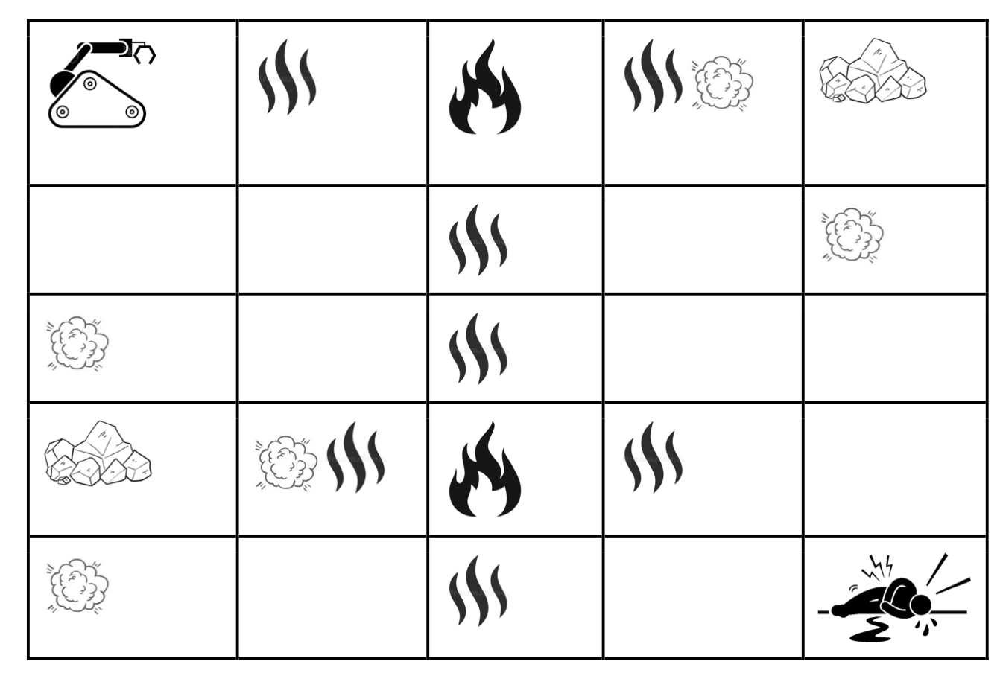

# Intelligence Artificielle

Dans le cadre de ce dernier projet il s'agira de construire un simulateur de robot qui sauve des vies. Le robot doit être un agent intelligent sous la forme d'un système expert utilisant la logique pour trouver des survivants. Il pourra rechercher des lieux dévastés, tels que des bâtiments en ruine et des bâtiments en feu ou même des villes victimes de catastrophes naturelles, pour trouver des survivants. Pour cela, grâce à ses capteurs, il doit détecter la chaleur et identifier les incendies ou détecter les poussières et identifier les décombres. Lors de la détection des incendies, il doit utiliser son extincteur pour jeter de l'eau et éteindre le feu. Lors de la détection de décombres, vous devez esquiver pour ne pas rester coincé. Le robot atteint son objectif en trouvant une personne survivante. Le robot sait qu'il a trouvé la personne car il dispose d'un microphone qui détecte ses cris. Le robot se déplace vers le haut, le bas, la gauche et la droite. Le robot ne se déplace pas en diagonale.

### Détail de l'environement

L'environnement doit être généré aléatoirement et doit être représenté par un tableau comme représenté ci-dessous. Au fur et à mesure que l'on développe un simulateur, plusieurs scénarios avec différents niveaux de difficulté doivent être générés. Ainsi, initialement le tableau commence par une dimension 3x3 et à chaque niveau il augmente d'une dimension : 4x4, 5x5, successivement. Les décombres, le feu et la personne vivante doivent être ajoutés au hasard au moment de la génération de la table à chaque niveau. Le robot doit toujours démarrer à la position 0x0. Il ne devrait y avoir qu'une seule personne survivante à chaque niveau et cette personne devrait se voir attribuer une position généré au hasard. Les cellules adjacentes aux décombres émettent de la poussière. Les cellules adjacentes aux feux émettent de la chaleur.
<br />


### Détails de l'agent

En plus des cellules déjà parcourues, l'agent ne peut voir que les cellules adjacentes à la position actuelle. L'agent décide vers quelle cellule il se déplacera grâce à l'inférence du système expert, qui permet de déterminer la meilleure cellule pour que le robot utilise son actionneur. Dès qu'il constate un incendie, l'agent peut éteindre le feu avec de l'eau grâce à son actionneur ou emprunter un autre chemin (l'algorithme de raisonnement déductif décidera de la décision à prendre en fonction de la probabilité générée). Dès qu'il remarque des décombres, l'agent doit contourner les décombres en empruntant un autre chemin. Une fois la personne trouvée, l'agent la sauve et passe à un niveau de difficulté plus élevé, augmentant la taille du tableau.

### Algorithme utilisé

On utilise des sytèmes experts dans l'analyse avec un algorithme de chaînage avant.
L'heuristique de l'agent utilise un algorithme greedy pour le choix du chemin.

### Lancement de l'application

Suivez les etapes suivantes pour lancer l'appliaction : 

- Rendez-vous dans le terminal de votre IDE et placez vous à la racine du projet. 
  
- Tapez la ligne de commande suivante dans votre terminal : 
 ```pip install -r requirements.txt``` 
- Puis tapez la ligne de commande suivante dans votre terminal : 
 ```python main.py ```  
